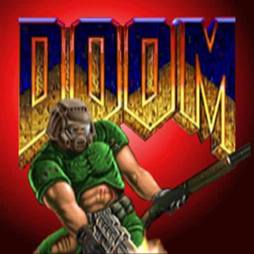

# GZDoom for Android
 
A fork of D-Touch that aims to be the de facto port of GZDoom on Android.

## Lineage
ZDoom is fork of original Doom to add some more functionality.

GZDoom is fork of ZDoom to make it working with OpenGL

GZDoom-Android is fork of GZDoom to make it working on Android

and my fork of GZDoom-Android was just a modification to make it working in the virtual reality

## Building
    git submodule update --init
    ./gradlew assemble

## Discontinued
This project was just an experiment. Other people use "hello world" to test new technologies, I forked the project and tried to modify it. Many people wrote into the beta comments that they are looking forward to the final version BUT there won't be any final version. I wanted to make it working using my own VR SDK (until commit "LucidVR SDK replaced with DaydreamSDK") but there was an issue that it requied extra permissions, and I never solved the issue of connecting Daydream Controller with the device.

It was also very problematic to make people from Google believe that I am allowed to use the licence of shareware IWAD (Doom I demo levels). I put into Google Play a version using Daydream BUT it never can reach Daydream certification (it is using GLES1 and Daydream requieres GLES2). You can download it here: https://play.google.com/store/apps/details?id=com.lucidvr.gzdoom

Many users are complaining that it is for VR. There is a version using "normal" mode: https://play.google.com/store/apps/details?id=net.nullsum.freedoom

Feel free to make a fork of this or to put some of my ideas back into the original repository.
